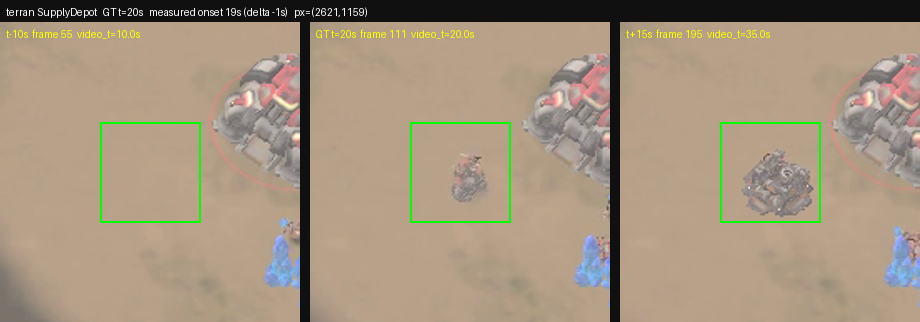
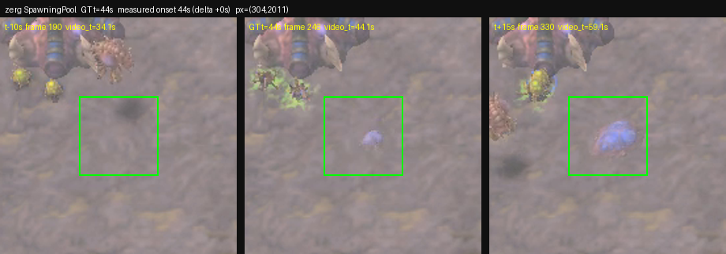
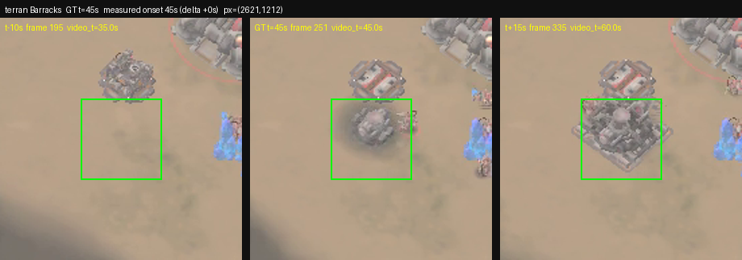
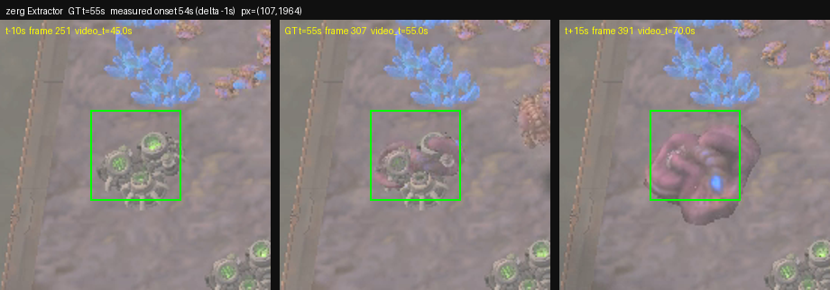
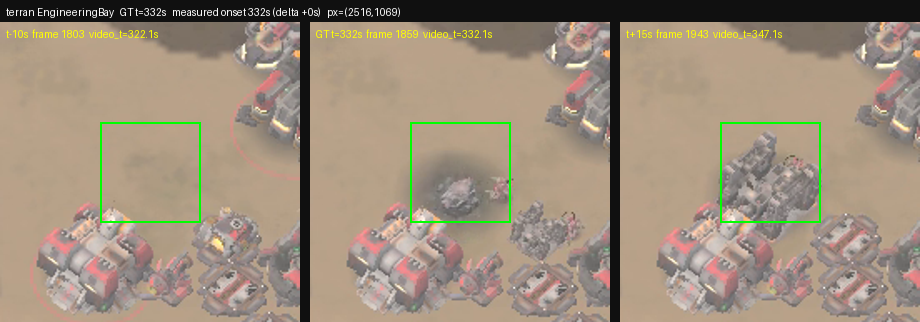
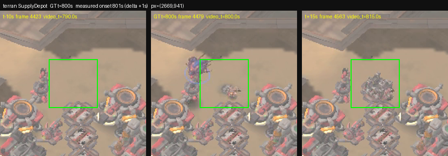

# GT <-> video alignment (measured, with screenshots)

Regenerate with `python calibration/verify_events.py` (add `--grid` for the
localisation views). The method is in that script's docstring; in short, each
landmark's montage pixel was read off the base-region renders below, and the
moment it appears is then measured from the pixels alone as a step in
*normalised edge energy* (shadow-invariant: this map has large moving cloud
shadows that a brightness test cannot tell apart from a new building).
`video_time = frame_index / 15`, `tiles/frames_time.json` maps frame ->
game-second, and GT seconds are `round(game_loop / 22.4)`.

| race | structure | GT t (s) | montage px | edge before -> after | measured onset (s) | delta (s) |
|---|---|---|---|---|---|---|
| terran | SupplyDepot | 20 | 2621,1159 | 0.0032 -> 0.0204 | 19 | -1 |
| zerg | SpawningPool | 44 | 304,2011 | 0.0187 -> 0.0222 | 44 | +0 |
| terran | Barracks | 45 | 2621,1212 | 0.0094 -> 0.0549 | 45 | +0 |
| zerg | Extractor | 55 | 107,1964 | 0.0984 -> 0.0962 | 54 | -1 |
| terran | EngineeringBay | 332 | 2516,1069 | 0.0139 -> 0.0540 | 332 | +0 |
| terran | SupplyDepot | 800 | 2669,941 | 0.0122 -> 0.0394 | 801 | +1 |

**6 of 6 landmarks measured, all within the scorer's +/-3 s** (median +0.0 s, mean -0.2 s, max |delta| 1 s). The onset is timed to the FORMAL construction start (the tracker's UnitInitEvent), not the placement animation: a building appears in two stages on this render, a 1-2 s edge-energy spike when the builder places the foundation (which leads the tracker event) and then a dip, then a sustained ramp as it grows, so the detector skips the placement spike and fires at the dip just before the ramp. The resulting deltas are within +/-1 s of the GT, well inside the +/-3 s match window used by `steps/solve/tests/judge.py`, and the same sign and size early (t=20) and late (t=800), i.e. there is no clock drift over the 15 minutes of the game.

## Screenshots: before / at the GT second / after

The green box is the 60x60 montage-pixel window whose edge energy was measured. Each panel is labelled with its frame index and the game-second that frame belongs to.

### terran SupplyDepot — GT t=20 s, measured -1 s

empty ground at t=10, depot under construction at t=30

### zerg SpawningPool — GT t=44 s, measured +0 s

bare creep at t=30, pool at t=80

### terran Barracks — GT t=45 s, measured +0 s

empty at t=30, barracks at t=60

### zerg Extractor — GT t=55 s, measured -1 s

bare vespene geyser at t=30, extractor on it at t=80

### terran EngineeringBay — GT t=332 s, measured +0 s

empty at t=325, bay at t=355

### terran SupplyDepot — GT t=800 s, measured +1 s

empty at t=790, depot at t=815

## Per-landmark edge-energy series

One value per game-second; the flat run before the event is empty ground.

`terran SupplyDepot GT=20`: 8:0.0032, 9:0.0032, 10:0.0032, 11:0.0032, 12:0.0032, 13:0.0032, 14:0.0032, 15:0.0032, 16:0.0032, 17:0.0032, 18:0.0618, 19:0.0204, 20:0.0258, 21:0.0425, 22:0.0445, 23:0.0453, 24:0.0397, 25:0.0383, 26:0.0373, 27:0.0466, 28:0.0510, 29:0.0511, 30:0.0536, 31:0.0520, 32:0.0526, 33:0.0518, 34:0.0675, 35:0.0698, 36:0.0718, 37:0.0730, 38:0.0678, 39:0.0662, 40:0.0732

`zerg SpawningPool GT=44`: 32:0.0182, 33:0.0189, 34:0.0196, 35:0.0194, 36:0.0182, 37:0.0180, 38:0.0194, 39:0.0188, 40:0.0179, 41:0.0178, 42:0.0180, 43:0.0845, 44:0.0222, 45:0.0278, 46:0.0284, 47:0.0288, 48:0.0288, 49:0.0289, 50:0.0286, 51:0.0296, 52:0.0284, 53:0.0287, 54:0.0297, 55:0.0287, 56:0.0291, 57:0.0291, 58:0.0290, 59:0.0290, 60:0.0295, 61:0.0363, 62:0.0374, 63:0.0416, 64:0.0572

`terran Barracks GT=45`: 33:0.0060, 34:0.0101, 35:0.0101, 36:0.0101, 37:0.0101, 38:0.0100, 39:0.0102, 40:0.0101, 41:0.0101, 42:0.0101, 43:0.0101, 44:0.0871, 45:0.0549, 46:0.0672, 47:0.1122, 48:0.1181, 49:0.1169, 50:0.1171, 51:0.1160, 52:0.1228, 53:0.1233, 54:0.1198, 55:0.1215, 56:0.1197, 57:0.1262, 58:0.1275, 59:0.1260, 60:0.1259, 61:0.1208, 62:0.1208, 63:0.1235, 64:0.1230, 65:0.1222

`zerg Extractor GT=55`: 43:0.0989, 44:0.0980, 45:0.0974, 46:0.0993, 47:0.0978, 48:0.0990, 49:0.0983, 50:0.0979, 51:0.0976, 52:0.0978, 53:0.1133, 54:0.0962, 55:0.0862, 56:0.0827, 57:0.0817, 58:0.0829, 59:0.0821, 60:0.0803, 61:0.0823, 62:0.0485, 63:0.0513, 64:0.0511, 65:0.0573, 66:0.0526, 67:0.0511, 68:0.0531, 69:0.0529, 70:0.0548, 71:0.0543, 72:0.0543, 73:0.0565, 74:0.0576, 75:0.1028

`terran EngineeringBay GT=332`: 320:0.0139, 321:0.0139, 322:0.0139, 323:0.0139, 324:0.0139, 325:0.0139, 326:0.0139, 327:0.0139, 328:0.0139, 329:0.0926, 330:0.0925, 331:0.0925, 332:0.0540, 333:0.0677, 334:0.0906, 335:0.0967, 336:0.0923, 337:0.0943, 338:0.0904, 339:0.0929, 340:0.0917, 341:0.1140, 342:0.1156, 343:0.1158, 344:0.1140, 345:0.1203, 346:0.1205, 347:0.1218, 348:0.1213, 349:0.1281, 350:0.1213, 351:0.1316, 352:0.1313

`terran SupplyDepot GT=800`: 788:0.0122, 789:0.0122, 790:0.0122, 791:0.0122, 792:0.0122, 793:0.0122, 794:0.0122, 795:0.0122, 796:0.0122, 797:0.0617, 798:0.0632, 799:0.0758, 800:0.0453, 801:0.0394, 802:0.0517, 803:0.0519, 804:0.0545, 805:0.0496, 806:0.0627, 807:0.0509, 808:0.0593, 809:0.0630, 810:0.0633, 811:0.0630, 812:0.0625, 813:0.0629, 814:0.0625, 815:0.0731, 816:0.0744, 817:0.0757, 818:0.0744, 819:0.0749, 820:0.0725

## What is NOT claimed

- Only these six landmarks are measured, all inside the two main-base regions.
  Structures out on the map (expansions, forward Bunkers, MissileTurrets,
  SporeCrawlers) are not checked.
- Morphs (OrbitalCommand, Lair, Hive) are deliberately not used as landmarks:
  the morph animation changes the building gradually over tens of seconds, so
  an onset measured this way is not well defined for them.
- An unsupervised, whole-region version of this test does NOT work and is not
  shipped: cross-correlating the GT event series against region-wide change
  energy peaks at a nonzero shift, because army movement and creep spread
  dominate the region total. Per-landmark localisation is what carries the
  evidence here.
